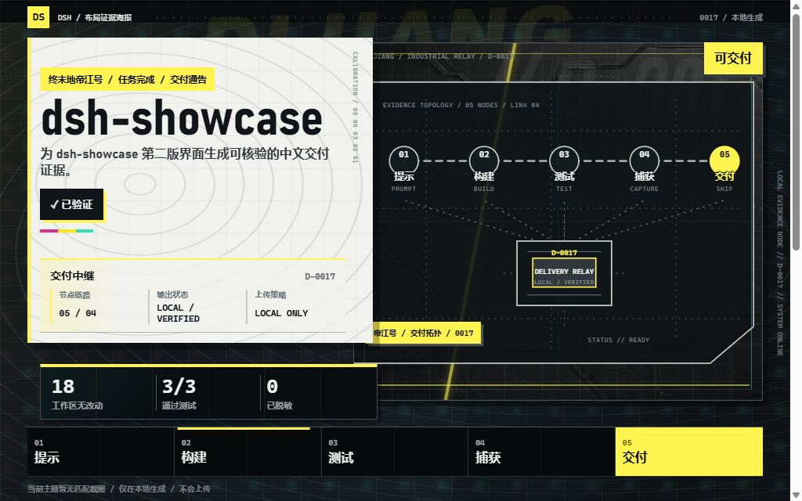
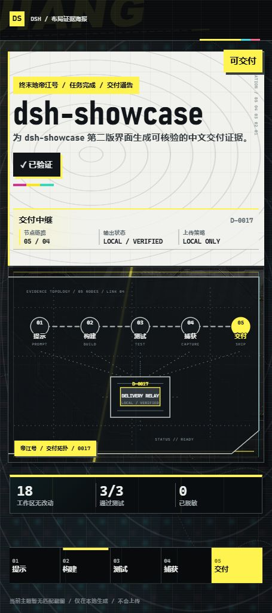
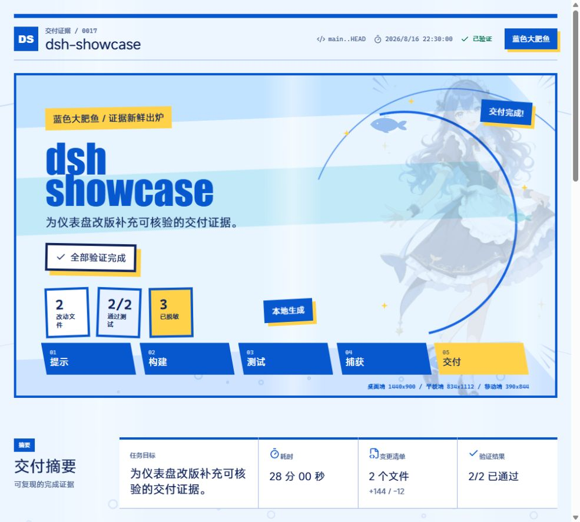
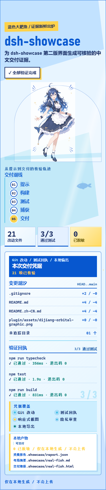

# dsh-showcase

[](https://github.com/DoveLi-Gu/dsh-showcase/actions/workflows/ci.yml)
[](LICENSE)
[](https://nodejs.org/)

**把编程 Agent 的改动和测试结果，整理成可核验的中文交付报告。**

dsh-showcase 是一个本地运行的 DSH 插件。它读取目标项目的 Git 改动、测试回执和可选截图，生成 Markdown 摘要与自包含 HTML 海报。

它不会上传项目文件，也不会把目标项目的数据写回本仓库。

> 本项目是社区工具，不是 DeepSeek、DSH 或《终末地》的官方产品。主题名仅描述视觉风格，不代表官方授权。演示素材说明见 [CHARACTER_ASSET_NOTICE.md](CHARACTER_ASSET_NOTICE.md)。

**目录**： [功能](#它能帮你做什么) · [赞助商](#赞助商) · [快速开始](#5-分钟快速开始) · [产物](#生成了哪些文件) · [截图](#截图证据) · [工具参数](#工具参数) · [边界与安全](#安全与边界) · [开发](#从源码开发)

## 先看效果

这是一个 **DSH 插件 + 本地采集 CLI**，不是只展示截图的主题包。插件负责把证据整理成摘要和海报；CLI 负责在任意目标项目中采集 Git 与测试回执。

<details>
<summary>终末地帝江号（机械工业 / 等高线 / 黄黑校准）</summary>

<p></p>
<p></p>
</details>

<details>
<summary>蓝色大肥鱼（浅蓝 / 钴蓝 / 角色主视觉）</summary>

<p></p>
<p></p>
</details>

## 你需要什么

- **必须**：已经可以运行的 DSH Web 环境；
- **必须**：Node.js 20+ 和 npm，用于安装本仓库及运行采集 CLI；
- **可选**：Git。没有 Git 时仍会生成报告，但状态会明确标为 `partial`；
- **可选**：Playwright 或其他浏览器验收工具。截图不是后端、CLI、库项目的必需项。

如果你只想查看海报，可以直接打开已经生成的 `.showcase/layout-poster.html`；如果你要让 DSH 读取新项目，按下面三步操作。

## 它能帮你做什么

| 你现在要做的事 | dsh-showcase 的输出 |
| --- | --- |
| 向别人说明这次改了什么 | Git 文件清单、增删行统计和当前引用 |
| 证明测试确实运行过 | 测试命令、退出码、耗时和脱敏后的输出 |
| 检查桌面和移动端界面 | 最多 3 张经过路径、时间和主题校验的截图 |
| 给交付结果做归档 | Markdown 摘要和可独立打开的 HTML 海报 |
| 证据还不完整 | 明确标记 `partial` 或 `failed`，不会伪装成功 |

支持前端、后端、CLI、Node.js、Python、Rust、Go、Java、库和静态 HTML 项目。

工作流只有一条：

```text
目标项目 → init 配置 → capture 采集 → report.json → DSH 工具 → Markdown / HTML
```

## 5 分钟快速开始

### 第一步：安装插件

当前版本尚未发布到 npm，因此先从 GitHub 源码安装。仓库放在固定目录后，DSH 插件和采集 CLI 可以共用同一份代码。

~~~powershell
Set-Location C:\tools
git clone https://github.com/DoveLi-Gu/dsh-showcase.git
Set-Location .\dsh-showcase
npm ci
dsh plugin --profile web add "C:\tools\dsh-showcase"
~~~

然后重启 `dsh web`，再新建一个会话。若命令提示 `dsh` 不存在，先安装并确认 DSH CLI 已加入 `PATH`；这不是本插件自身的安装错误。

打开 DSH 的插件设置，找到 **布局证据产物**。这里可以选择：

- **终末地帝江号**：机械工业、密集等高线和黄黑校准色；
- **蓝色大肥鱼**：浅蓝背景、角色主视觉和钴蓝强调；
- **生成自包含 HTML 海报**：关闭时只生成 Markdown，开启后同时生成 HTML。

主题只在插件设置中选择，目标项目不需要增加主题字段。

> **发布到 npm 后**：DSH 插件入口会改为 `dsh plugin --profile web add dsh-showcase`。当前版本尚未发布到 npm，也不要使用 `npm install --global dsh-showcase`：npm 包目前提供的是 DSH 插件运行时，不是全局 CLI。采集 CLI 仍按上面的 GitHub 源码目录运行。

### 第二步：在目标项目采集证据

进入你真正要检查的项目：

~~~powershell
Set-Location C:\work\your-project
$showcaseRepo = "C:\tools\dsh-showcase"

& "$showcaseRepo\node_modules\.bin\tsx.cmd" `
  "$showcaseRepo\src\cli\index.ts" init
~~~

这会创建 `.showcase/config.json`。打开它，确认任务目标和测试命令：

~~~json
{
  "task": "完成用户设置页并通过回归测试",
  "baseRef": "HEAD~1",
  "timeoutMs": 120000,
  "tests": [
    "npm test",
    "npm run build"
  ]
}
~~~

然后执行采集：

~~~powershell
& "$showcaseRepo\node_modules\.bin\tsx.cmd" `
  "$showcaseRepo\src\cli\index.ts" capture
~~~

采集完成后，目标项目中会出现：

~~~text
.showcase/
├─ config.json       # 任务目标、Git 基准、测试和超时
└─ report.json       # Git 改动、测试回执、截图记录和脱敏统计
~~~

`init` 只需执行一次。如果 `config.json` 已存在，直接编辑后运行 `capture`。

### 第三步：让 DSH 生成报告

回到这个目标项目的 DSH 会话，直接发送：

> 请调用 `showcase_layout_summary`，以当前项目为 `projectPath`，读取 `.showcase/report.json` 并生成中文交付摘要。本次需要 HTML 海报，请把 `generatePoster` 设为 `true`。

等价的工具参数：

~~~json
{
  "projectPath": ".",
  "locale": "zh-CN",
  "generatePoster": true
}
~~~

`projectPath` 是唯一必填参数。默认输出：

~~~text
.showcase/layout-summary.md
.showcase/layout-poster.html
~~~

只想生成 Markdown 时，将 `generatePoster` 设为 `false`，或关闭插件设置里的海报开关。

### 最小可用命令

如果你不需要自定义任务，下面是一次完整的最短流程（在目标项目目录执行）：

~~~powershell
$showcaseRepo = "C:\tools\dsh-showcase"
& "$showcaseRepo\node_modules\.bin\tsx.cmd" "$showcaseRepo\src\cli\index.ts" init
& "$showcaseRepo\node_modules\.bin\tsx.cmd" "$showcaseRepo\src\cli\index.ts" capture
~~~

随后在 DSH 会话中调用 `showcase_layout_summary`。`init` 只执行一次；以后每次改完代码、测试和截图后，只需要重新执行 `capture`，再重新生成摘要。

## 赞助商

感谢 **鸽子中转站（Pigeon Relay）** 对 `dsh-showcase` 的支持。

<table align="center">
  <tr>
    <td align="center" width="180">
      <a href="https://api.doveli.top/">
        
      </a>
    </td>
    <td>
      <h3><a href="https://api.doveli.top/">鸽子中转站</a></h3>
      <p><code>PIGEON RELAY</code> · 独立运营的 AI API 中转服务</p>
      <p>面向支持兼容 API 的开发工具，提供服务入口与可用性查询。</p>
      <p><a href="https://api.doveli.top/">访问服务</a> · <a href="https://api.doveli.top/status/">查看状态</a></p>
    </td>
  </tr>
</table>

<p align="center">
  <a href="https://github.com/DoveLi-Gu/dsh-showcase/issues">申请展示赞助</a>
</p>

> 这是独立第三方服务，与 `dsh-showcase`、DSH、DeepSeek 或 OpenAI 没有官方隶属关系。使用前请自行确认服务条款、价格、隐私政策和可用性；本项目不代收款、不保存 API Key，也不保证第三方服务持续可用。

## 最省事的用法

安装插件后，也可以让有终端权限的 DSH Agent 完成采集和汇总。把下面这段话里的工具目录改成你的实际路径：

> 使用 `C:\tools\dsh-showcase` 的 CLI 检查当前项目。如果没有 `.showcase/config.json`，先执行 init 并让我确认测试命令；然后执行 capture，最后调用 `showcase_layout_summary` 生成中文 Markdown 和 HTML 海报。不要上传任何项目文件。

这样用户只需要确认测试命令，不需要手动编写工具参数。

## 生成了哪些文件

| 文件 | 作用 | 建议提交 Git |
| --- | --- | --- |
| `.showcase/config.json` | 当前项目的采集配置 | 按团队需要决定 |
| `.showcase/report.json` | 结构化 Git、测试和截图回执 | 通常不提交 |
| `.showcase/layout-summary.md` | 适合审查和聊天阅读的摘要 | 通常不提交 |
| `.showcase/layout-poster.html` | 可单独打开的展示海报 | 通常不提交 |

本仓库已经默认忽略 `.showcase/`。其他项目也建议把它加入 `.gitignore`：

~~~gitignore
.showcase/
~~~

## 测试命令如何确定

`init` 会根据项目文件尝试填写默认测试：

| 检测到的文件 | 默认测试 |
| --- | --- |
| `package.json` 中存在 `scripts.test` | `npm test` |
| `pyproject.toml`、`pytest.ini`、`setup.cfg` 或 `requirements.txt` | `pytest -q` |
| `Cargo.toml` | `cargo test` |
| `go.mod` | `go test ./...` |
| `pom.xml` | `mvn test` |
| `gradlew.bat` | `gradlew.bat test` |

测试也可以单独设置超时：

~~~json
{
  "tests": [
    "npm test",
    {
      "command": "pytest -q",
      "timeoutMs": 180000
    }
  ]
}
~~~

没有识别到测试时仍会生成报告，但状态会是 `partial`。

## 截图证据

CLI 会保留 `report.json` 中已经存在的截图记录，但不会自动启动浏览器截图。

前端项目可以用 Playwright、浏览器验收工具或自己的截图脚本，把图片保存在目标项目内，再把记录加入 `report.json.screenshots`：

~~~json
{
  "id": "desktop-after",
  "label": "桌面完成态",
  "theme": "frontier-signal",
  "viewport": {
    "name": "desktop",
    "width": 1440,
    "height": 900
  },
  "imagePath": "evidence/desktop-after.png",
  "capturedAt": "2026-08-20T10:00:00.000Z",
  "kind": "after",
  "url": "http://localhost:4173/"
}
~~~

截图规则：

- `imagePath` 必须位于目标项目内部；
- `theme` 使用 `frontier-signal` 或 `blue-big-fish`；
- 截图主题必须与 DSH 插件当前主题匹配；
- 缺失、过期、跨主题或不可读的截图不会被当成有效证据；
- 没有可视界面的项目可以不提供截图。

截图不是“随便放一张图片”：它必须属于目标项目、采集时间不能晚于报告、格式和尺寸必须可读，而且主题要和当前海报一致。跨主题截图会保留在报告里，但会从当前海报隔离出去。

`frontier-signal` 是“终末地帝江号”的内部兼容键，不是第三套主题；普通用户只需要在 DSH 设置中选择中文主题名。

## 工具参数

工具名：`showcase_layout_summary`

| 参数 | 必填 | 默认值或用途 |
| --- | --- | --- |
| `projectPath` | 是 | 目标项目根目录 |
| `reportPath` | 否 | `.showcase/report.json` |
| `outputPath` | 否 | `.showcase/layout-summary.md` |
| `posterPath` | 否 | `.showcase/layout-poster.html` |
| `locale` | 否 | `zh-CN`；也支持 `en` |
| `generatePoster` | 否 | 覆盖本次调用，不修改持久设置 |
| `appPath` | 否 | 特殊目录项目的布局源码路径 |
| `cssPath` | 否 | 特殊目录项目的样式文件路径 |

特殊项目结构示例：

~~~json
{
  "projectPath": "C:/work/your-project",
  "appPath": "src/client/App.tsx",
  "cssPath": "src/client/styles.css",
  "locale": "zh-CN",
  "generatePoster": false
}
~~~

## 常见问题

### 为什么没有生成 HTML 海报？

检查插件设置中的海报开关，或在本次调用中传入 `"generatePoster": true`。Markdown 默认仍会生成。

### 为什么状态是 partial？

采集阶段通常是没有 Git 或没有可运行的测试命令；汇总阶段还可能额外提示截图缺失或过期。`partial` 的含义是“可以继续审查，但证据不完整”，不是程序崩溃。

### 为什么截图没有出现在海报里？

检查文件是否存在、路径是否位于目标项目内、`capturedAt` 是否早于图片修改时间，以及截图主题是否匹配。

### 可以用于非前端项目吗？

可以。后端、CLI 和库项目不要求截图，仍可生成 Git 与测试回执。

## 安全与边界

- 所有默认产物只写入目标项目的 `.showcase/`；
- 没有远程上传步骤；
- 常见 Token、Authorization、GitHub Token 格式和本机绝对路径会尝试脱敏；
- 报告最大 2 MiB，单张截图最大 8 MiB、尺寸不超过 16384 px；
- 每张海报最多嵌入 3 张有效截图；
- 脱敏不是绝对保证，公开分享前仍需人工检查。

## 从源码开发

~~~powershell
npm ci
npm run check
npm run dev
~~~

主要目录：

~~~text
src/                  CLI、报告 schema、Git、命令和脱敏逻辑
plugin/               DSH 插件、设置面板、摘要和海报生成器
tests/                单元、跨项目、极端输入和产物测试
docs/                 使用、上传、发布和预览素材
.github/workflows/    Node 20/22 CI
~~~

维护文档：

- [贡献指南](CONTRIBUTING.md)
- [安全策略](SECURITY.md)
- [发布检查清单](docs/RELEASE_CHECKLIST_ZH.md)
- [GitHub 上传与维护指南](docs/GITHUB_UPLOAD_GUIDE_ZH.md)
- [演示素材授权说明](CHARACTER_ASSET_NOTICE.md)

## 许可证

源代码和普通仓库文件使用 MIT，详见 [LICENSE](LICENSE)。演示角色、照片和主题截图不自动包含在 MIT 授权中，详见 [CHARACTER_ASSET_NOTICE.md](CHARACTER_ASSET_NOTICE.md)。
