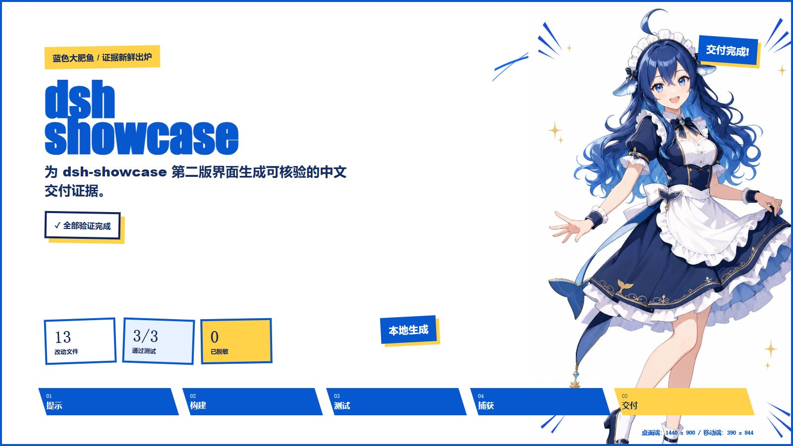

# dsh-showcase

[Chinese README](README.zh-CN.md)

Local, verifiable delivery evidence reports for coding-agent work.


`dsh-showcase` turns local project evidence into reviewable artifacts: Git changes, test receipts, redaction results, layout evidence, and visual report output. It works without an account or upload requirement.

## What It Includes

- Evidence reports that collect task metadata, Git changes, test receipts, and redaction summaries.
- Git evidence for the current working tree or a configured base reference.
- Test execution receipts with command, duration, exit code, status, and redacted output.
- Built-in redaction for common tokens, authorization values, GitHub token patterns, and local absolute paths in captured output.
- Two independently composed poster directions: **Frontier Signal (`边境信号`)** and **Blue Big Fish (`蓝色大肥鱼`)**. The active direction is selected in DSH plugin settings rather than inside the report.
- Persistent atmosphere with `prefers-reduced-motion` support: architectural drift, mechanical masking, and signal flow for Frontier Signal; character float, rotating comic arcs, and gold sparkle pulses for Blue Big Fish.
- CLI commands for initializing local configuration and capturing a report.
- A DSH plugin tool, `showcase_layout_summary`, for producing a local Markdown layout summary and a self-contained evidence poster.
- Local Markdown artifacts and a self-contained HTML poster. The plugin reads project files, writes inside the project, and does not upload content.




## Quick Start

Install dependencies, then initialize and capture evidence in the project you want to document:

```bash
npm ci
npm run init
npm run capture
```

`npm run init` creates `.showcase/config.json`. Edit it to set the task, optional Git base reference, test commands, and timeout. `npm run capture` writes `.showcase/report.json`.

Example configuration:

```json
{
  "task": "Capture verifiable delivery evidence.",
  "baseRef": "main",
  "tests": [
    "npm test -- --run",
    { "command": "npm run typecheck", "timeoutMs": 120000 }
  ],
  "timeoutMs": 120000
}
```

## DSH Plugin

From this repository, add the plugin to the web profile:

```bash
dsh plugin --profile web add .
```

Restart DSH, then create a **new session** before using the tool. The new session is required for the plugin tool to become available.

In **Settings → Plugins → Plugin configuration → Layout evidence poster**, choose one poster theme: Frontier Signal or Blue Big Fish. The choice is stored in DSH user settings, and each tool call generates only the currently selected theme.

`showcase_layout_summary` accepts the following parameters:

```json
{
  "projectPath": ".",
  "reportPath": ".showcase/report.json",
  "outputPath": ".showcase/layout-summary.md",
  "posterPath": ".showcase/layout-poster.html",
  "locale": "zh-CN"
}
```

Only `projectPath` is required. `locale` is optional and defaults to `zh-CN`; use `en` for English output. The remaining paths are project-relative and optional. The generated Markdown summary and HTML poster remain local to the project.

## Development

```bash
npm ci
npm run dev
npm run typecheck
npm test
npm run build
npm run cli -- init
npm run cli -- capture
```

## Project Structure

```text
src/
  cli/          Local init and capture commands
  core/         Report schema, Git collection, command receipts, redaction
  App.tsx       Report interface and theme support
plugin/
  index.js      DSH plugin registration
  layout-summary.js
                Local layout summary and self-contained poster generator
  assets/       Plugin poster asset
docs/assets/    README report screenshots
```

## Roadmap

- Extend capture with responsive screenshot collection.
- Export additional static report artifacts from the CLI.
- Add further coding-agent adapters while keeping the report format local-first.

## Privacy

Reports are generated locally. Captured test output is passed through redaction rules for common credentials and local absolute paths before being written to the report. Review generated artifacts before sharing them: redaction rules reduce accidental exposure but cannot guarantee detection of every sensitive value.

See [CHARACTER_ASSET_NOTICE.md](CHARACTER_ASSET_NOTICE.md) for the scope of the repository license and the separate notice for demonstration character assets.

## License

MIT. See [LICENSE](LICENSE).
