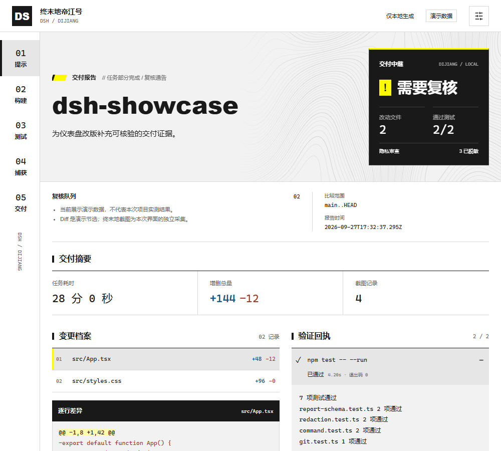
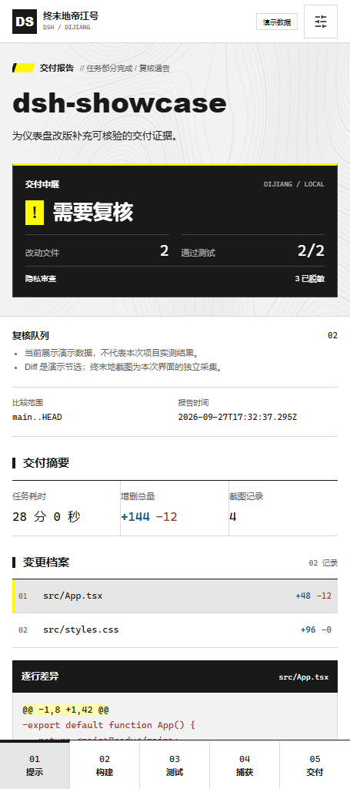
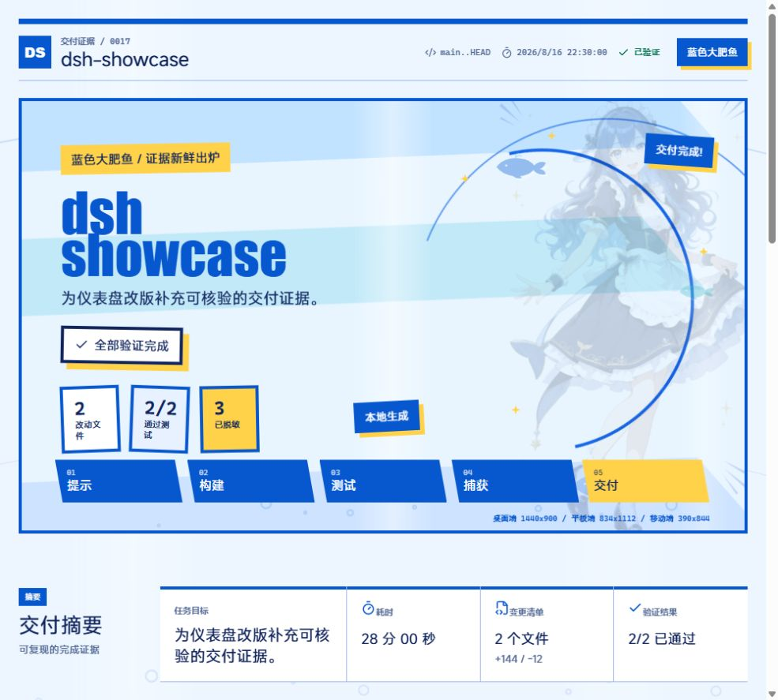
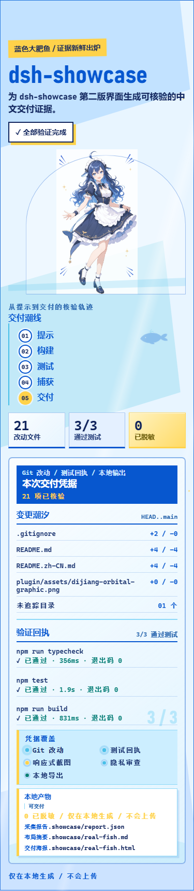

# dsh-showcase

[](https://github.com/DoveLi-Gu/dsh-showcase/actions/workflows/ci.yml)
[](LICENSE)
[](https://nodejs.org/)

**把编程 Agent 的改动和测试结果，整理成可核验的中文交付报告。**

dsh-showcase 是一个本地运行的 DSH 插件。它读取目标项目的 Git 改动、测试回执和可选截图，生成 Markdown 摘要与自包含 HTML 海报。

它不会上传项目文件，也不会把目标项目的数据写回本仓库。

> 本项目是社区工具，不是 DeepSeek、DSH 或《终末地》的官方产品。主题名仅描述视觉风格，不代表官方授权。演示素材说明见 [CHARACTER_ASSET_NOTICE.md](CHARACTER_ASSET_NOTICE.md)。

**目录**： [功能](#它能帮你做什么) · [快速开始](#5-分钟快速开始) · [赞助商](#赞助商) · [产物](#生成了哪些文件) · [截图](#截图证据) · [工具参数](#工具参数) · [边界与安全](#安全与边界) · [开发](#从源码开发)

## 先看效果

这是一个 **DSH 插件 + 本地采集 CLI**，不是只展示截图的主题包。插件负责把证据整理成摘要和海报；CLI 负责在任意目标项目中采集 Git 与测试回执。

<details>
<summary>终末地帝江号（机械工业 / 等高线 / 黄黑校准）</summary>

<p></p>
<p></p>

终末地主题采用白、浅灰与硬黑分区，搭配信号黄、局部等高线和细分隔线。左侧阶段导航在手机上收至底部；变更档案与验证回执前置，截图保留完整画面。深色加载页以旋转仪表和信号色横向扫幕进入报告。右上角可切换明暗、谷地黄 / 武陵青、动效及背景帧率上限。这些是社区主题设计，预览中的演示数据不代表目标项目已通过验证。
</details>

<details>
<summary>蓝色大肥鱼（浅蓝 / 钴蓝 / 角色主视觉）</summary>

<p></p>
<p></p>
</details>

## 你需要什么

- **必须**：已经可以运行的 DSH Web 环境（当前插件兼容 DSH `0.2.0-rc.2` 及同一 0.2 系列）；
- **必须**：Node.js `22.19+` 或 `24+` 和 npm，用于安装本仓库及运行采集 CLI；
- **可选**：Git。没有 Git 时仍会生成报告，但状态会明确标为 `partial`；
- **可选**：Playwright 或其他浏览器验收工具。截图不是后端、CLI、库项目的必需项。

如果你只想查看海报，可以直接打开已经生成的 `.showcase/layout-poster.html`；如果你要让 DSH 读取新项目，按下面三步操作。

## 它能帮你做什么

| 你现在要做的事 | dsh-showcase 的输出 |
| --- | --- |
| 向别人说明这次改了什么 | Git 文件清单、增删行统计、当前引用；终末地报告可切换文件查看保留的逐行 Diff |
| 证明测试确实运行过 | 测试命令、退出码、耗时和脱敏后的输出 |
| 检查桌面和移动端界面 | 最多 3 张经过路径、时间和主题校验的截图 |
| 给交付结果做归档 | Markdown 摘要和可独立打开的 HTML 海报 |
| 证据还不完整 | 明确标记 `partial` 或 `failed`，不会伪装成功 |

支持前端、后端、CLI、Node.js、Python、Rust、Go、Java、库和静态 HTML 项目。

终末地 HTML 还包含任务耗时、增删总量、脱敏分类明细，以及 HTML / JSON / Markdown 下载。同页同视口的 Before / After 截图可用滑块对比。JSON 是脱敏后的报告数据，不包含图片二进制；HTML 内嵌图片，可以离线查看和操作。

`capture` 会为前 20 个变更文件尝试采集文本 Diff，每份最多保留 16,000 个字符并标注截断。二进制、未跟踪、超大或无法读取的文件只保留明确的缺失说明；旧报告没有 Diff 时不会生成假差异。补丁仍需人工复核后再对外分享。

工作流只有一条：

```text
目标项目 → init 配置 → capture 采集 → report.json → DSH 工具 → Markdown / HTML
```

## 5 分钟快速开始

<details>
<summary><strong>第一步：安装插件</strong></summary>

插件运行时已发布到 npm。推荐优先使用 npm 安装插件；如果需要运行采集 CLI 或参与开发，再从 GitHub 源码安装完整仓库。

~~~powershell
dsh plugin --profile web add dsh-showcase
~~~

如果你需要同时使用采集 CLI，继续按下面的源码方式安装。仓库放在固定目录后，DSH 插件和采集 CLI 可以共用同一份代码。

~~~powershell
Set-Location C:\tools
git clone https://github.com/DoveLi-Gu/dsh-showcase.git
Set-Location .\dsh-showcase
npm ci
dsh plugin --profile web add "C:\tools\dsh-showcase"
~~~

然后重启 `dsh web`，再新建一个会话。若命令提示 `dsh` 不存在，先安装并确认 DSH CLI 已加入 `PATH`；这不是本插件自身的安装错误。

打开 DSH 侧栏的 **插件**，进入 `dsh-showcase`，点击组件 `dsh-showcase/plugin` 的 **配置**，找到 **布局证据产物**。这里可以选择：

- **终末地帝江号**：机械工业、密集等高线和黄黑校准色；
- **蓝色大肥鱼**：浅蓝背景、角色主视觉和钴蓝强调；
- **生成自包含 HTML 海报**：关闭时只生成 Markdown，开启后同时生成 HTML。

主题只在插件设置中选择，目标项目不需要增加主题字段。

> **npm 包说明**：插件入口可以使用 `dsh plugin --profile web add dsh-showcase` 安装。不要使用 `npm install --global dsh-showcase`：npm 包提供的是 DSH 插件运行时，不是全局 CLI。采集 CLI 仍按上面的 GitHub 源码目录运行。

</details>

<details>
<summary><strong>第二步：在目标项目采集证据</strong></summary>

进入你真正要检查的项目：

~~~powershell
Set-Location C:\work\your-project
$showcaseRepo = "C:\tools\dsh-showcase"

& "$showcaseRepo\node_modules\.bin\tsx.cmd" `
  "$showcaseRepo\src\cli\index.ts" init
~~~

这会创建 `.showcase/config.json`。打开它，确认任务目标和测试命令：

~~~json
{
  "task": "完成用户设置页并通过回归测试",
  "baseRef": "HEAD~1",
  "timeoutMs": 120000,
  "tests": [
    "npm test",
    "npm run build"
  ]
}
~~~

然后执行采集：

~~~powershell
& "$showcaseRepo\node_modules\.bin\tsx.cmd" `
  "$showcaseRepo\src\cli\index.ts" capture
~~~

采集完成后，目标项目中会出现：

~~~text
.showcase/
├─ config.json       # 任务目标、Git 基准、测试和超时
└─ report.json       # Git 改动、测试回执、截图记录和脱敏统计
~~~

`init` 只需执行一次。如果 `config.json` 已存在，直接编辑后运行 `capture`。

</details>

<details>
<summary><strong>第三步：让 DSH 生成报告</strong></summary>

回到这个目标项目的 DSH 会话，直接发送：

> 请调用 `showcase_layout_summary`，以当前项目为 `projectPath`，读取 `.showcase/report.json` 并生成中文交付摘要。本次需要 HTML 海报，请把 `generatePoster` 设为 `true`。

等价的工具参数：

~~~json
{
  "projectPath": ".",
  "locale": "zh-CN",
  "generatePoster": true
}
~~~

`projectPath` 是唯一必填参数。默认输出：

~~~text
.showcase/layout-summary.md
.showcase/layout-poster.html
~~~

只想生成 Markdown 时，将 `generatePoster` 设为 `false`，或关闭插件设置里的海报开关。

</details>

<details>
<summary><strong>补充：最小可用命令</strong></summary>

如果你不需要自定义任务，下面是一次完整的最短流程（在目标项目目录执行）：

~~~powershell
$showcaseRepo = "C:\tools\dsh-showcase"
& "$showcaseRepo\node_modules\.bin\tsx.cmd" "$showcaseRepo\src\cli\index.ts" init
& "$showcaseRepo\node_modules\.bin\tsx.cmd" "$showcaseRepo\src\cli\index.ts" capture
~~~

随后在 DSH 会话中调用 `showcase_layout_summary`。`init` 只执行一次；以后每次改完代码、测试和截图后，只需要重新执行 `capture`，再重新生成摘要。

</details>

## 在 DSH 生态中被发现

DeepSeek Harness 官方目前没有单独的插件提交审核页面；官方仓库建议插件作者给 GitHub 仓库添加 `dsh-plugin` Topic，用于社区发现。本仓库已经配置 `dsh-plugin`、`deepseek-harness`、`dsh` 和 `cordis` 等主题标签。

部分社区插件目录会定期扫描 `dsh-plugin` Topic，并根据公开仓库的 `package.json`、`dsh.bundle.patch`、入口文件和版本信息生成卡片。收录通常存在延迟，目录属于社区项目，不代表 DeepSeek 官方背书；用户仍可直接使用 DSH 官方命令安装：

~~~powershell
dsh plugin --profile web add dsh-showcase
~~~

- 官方生态说明：[DeepSeek Harness](https://github.com/deepseek-ai/deepseek-harness)
- 社区目录示例：[DSH Plugins Marketplace](https://github.com/bradeGithub/DSH-Plugins-Marketplace)
- 社区展示与反馈：DeepSeek Harness 仓库的 **Show Your Plugins** Discussions

## 赞助商

<div align="center">
  <p><strong>项目主赞助</strong></p>
  <a href="https://api.doveli.top/">
    
  </a>
  <h3><a href="https://api.doveli.top/">鸽子中转站 · Pigeon API Relay</a></h3>
  <p><strong>稳定、透明、易接入的 AI API 中转服务</strong></p>
</div>

鸽子中转站（Pigeon API Relay）兼容 OpenAI API 格式，持续跟进主流模型与可用线路。当前重点覆盖 GPT-6.1 Sol、GPT-6 Astra / Sol / Luna、GPT-5.6 全系列、GPT-5.5 / 5.4，Claude Opus 5、Fable 5、Sonnet 5，DeepSeek V4 Pro / Flash、Gemini、Grok，以及 Qwen、Kimi、GLM 等国产模型，适用于 AI 编程、Agent 工具调用、客户端接入、日常对话、内容创作和图像生成等场景。

平台支持余额按量与订阅套餐两种方式，提供灵活的日卡、月卡方案；你可以在一个控制台中统一管理 API Key、模型调用、余额、用量和订阅权益，并查看模型价格、服务状态与详细接入文档。模型列表、可用线路、价格和套餐权益会随站内运营持续更新，最终以鸽子中转站实时信息为准。

站长也会不定期组织抽奖和用户福利，赠送 Token、体验额度或其他使用权益。活动时间、参与方式与发放规则以鸽子中转站公告为准，欢迎关注站内动态。

<p align="center">
  <code>兼容 OpenAI API</code> · <code>GPT-6 / GPT-5.6</code> · <code>DeepSeek V4</code> · <code>余额按量</code> · <code>日卡/月卡订阅</code> · <code>不定期抽奖送 Token</code>
</p>

<p align="center">
  <a href="https://api.doveli.top/register"><strong>创建账户</strong></a>
  · <a href="https://api.doveli.top/model-pricing/">模型与价格</a>
  · <a href="https://api.doveli.top/subscriptions">订阅套餐</a>
  · <a href="https://www.doveli.top/docs/">接入文档</a>
  · <a href="https://api.doveli.top/status/">服务状态</a>
</p>

<table>
  <thead>
    <tr>
      <th align="center" width="190">赞助商</th>
      <th align="left">介绍</th>
    </tr>
  </thead>
  <tbody>
    <tr>
      <td align="center" valign="middle">
        <a href="https://api.doveli.top/">
          <br>
          <strong>鸽子中转站</strong>
        </a>
      </td>
      <td>
        <p><strong>稳定、透明、易接入的 AI API 中转服务，兼容 OpenAI API 格式。</strong></p>
        <p>当前重点覆盖 GPT-6.1 Sol、GPT-6 Astra / Sol / Luna、GPT-5.6 全系列、GPT-5.5 / 5.4，Claude Opus 5、Fable 5、Sonnet 5，DeepSeek V4 Pro / Flash、Gemini、Grok，以及 Qwen、Kimi、GLM 等国产模型，适用于 AI 编程、Agent 工具调用、客户端接入、日常对话、内容创作和图像生成等场景。</p>
        <p>平台支持余额按量与订阅套餐，提供日卡、月卡等灵活方案；用户可以统一管理 API Key、模型调用、余额、用量和订阅权益，并查看模型价格、服务状态与详细接入文档。模型列表、线路、价格和套餐权益会持续更新，最终以站内实时信息为准。</p>
        <p><strong>不定期福利：</strong>站长会组织抽奖并赠送 Token、体验额度或其他使用权益，活动时间和参与规则以站内公告为准。</p>
      </td>
    </tr>
  </tbody>
</table>


## 最省事的用法

安装插件后，也可以让有终端权限的 DSH Agent 完成采集和汇总。把下面这段话里的工具目录改成你的实际路径：

> 使用 `C:\tools\dsh-showcase` 的 CLI 检查当前项目。如果没有 `.showcase/config.json`，先执行 init 并让我确认测试命令；然后执行 capture，最后调用 `showcase_layout_summary` 生成中文 Markdown 和 HTML 海报。不要上传任何项目文件。

这样用户只需要确认测试命令，不需要手动编写工具参数。

## 生成了哪些文件

| 文件 | 作用 | 建议提交 Git |
| --- | --- | --- |
| `.showcase/config.json` | 当前项目的采集配置 | 按团队需要决定 |
| `.showcase/report.json` | 结构化 Git、测试和截图回执 | 通常不提交 |
| `.showcase/layout-summary.md` | 适合审查和聊天阅读的摘要 | 通常不提交 |
| `.showcase/layout-poster.html` | 可单独打开的展示海报 | 通常不提交 |

本仓库已经默认忽略 `.showcase/`。其他项目也建议把它加入 `.gitignore`：

~~~gitignore
.showcase/
~~~

## 测试命令如何确定

`init` 会根据项目文件尝试填写默认测试：

| 检测到的文件 | 默认测试 |
| --- | --- |
| `package.json` 中存在 `scripts.test` | 按锁文件选择 `pnpm test`、`yarn test`、`bun run test`，否则 `npm test` |
| `pyproject.toml`、`pytest.ini`、`setup.cfg` 或 `requirements.txt` | `pytest -q` |
| `Cargo.toml` | `cargo test` |
| `go.mod` | `go test ./...` |
| `pom.xml` | `mvn test` |
| `gradlew.bat` | `gradlew.bat test` |
| POSIX 系统的 `gradlew` | `./gradlew test` |

混合技术栈会保留各语言的默认命令。自动检测只是初始建议，运行前请检查 `.showcase/config.json`，使用项目实际支持的、非 watch 模式的测试命令。

测试也可以单独设置超时：

~~~json
{
  "tests": [
    "npm test",
    {
      "command": "pytest -q",
      "timeoutMs": 180000
    }
  ]
}
~~~

没有识别到测试时仍会生成报告，但状态会是 `partial`。

## 截图证据

CLI 会保留 `report.json` 中已经存在的截图记录，但不会自动启动浏览器截图，也不会把旧截图时间更新成当前时间。建议先保存代码，再截图，最后运行 `capture` 并生成摘要。

前端项目可以用 Playwright、浏览器验收工具或自己的截图脚本，把图片保存在目标项目内，再把记录加入 `report.json.screenshots`：

~~~json
{
  "id": "desktop-after",
  "label": "桌面完成态",
  "viewport": {
    "name": "desktop",
    "width": 1440,
    "height": 900
  },
  "imagePath": "evidence/desktop-after.png",
  "capturedAt": "2026-08-20T10:00:00.000Z",
  "kind": "after",
  "deviceScaleFactor": 1,
  "captureMode": "viewport",
  "url": "http://localhost:4173/"
}
~~~

截图规则：

- `imagePath` 必须位于目标项目内部；
- 普通项目无需填写 `theme`，同一份证据可使用任意海报主题展示；
- 只有明确区分本项目两套视觉版本时才填写 `theme`，跨主题记录会被隔离；
- 缺失、过期、跨主题或不可读的截图不会被当成有效证据；
- `capturedAt` 应为真实采集时间，不能晚于报告，也不能早于截图文件或已发现源码的修改时间（容差 2 秒）；
- `viewport` 是浏览器 CSS 像素，`deviceScaleFactor` 是截图设备像素比；整屏用 `viewport`、整页用 `full-page`、局部裁剪用 `region`；
- 实际图片尺寸必须与视口、像素比匹配。局部裁剪和 `before` 图片会单独标注，不能代替改版后整屏验收；
- 可选 `sourceFingerprint` 记录截图时的 Git 工作区指纹，汇总时会与采集报告比对；
- 没有可视界面的项目可以不提供截图。

截图不是“随便放一张图片”：路径、格式、像素尺寸和时间都需要通过检查。缺少截图的视觉项目会标为待复核；检查说明同时出现在 Markdown 与 HTML。插件生成的海报最多嵌入 3 张有效截图，优先保留可配对的 Before / After，再补其他视口。

前后对比要求页面 URL、视口尺寸、采集模式及图片比例一致，不能使用局部裁剪。当旧版与新版地址不同但确实是同一页面时，可以给两条记录设置相同的 `comparisonId`。没有可用配对就显示缺失状态。仓库终末地演示页附带 3 张当前视口截图和 1 张本轮修改前截图，不占用目标项目的采集记录。

`frontier-signal` 是“终末地帝江号”的内部兼容键，不是第三套主题；普通用户只需要在 DSH 设置中选择中文主题名。

## 工具参数

### 换到其他项目

主题只改变交付报告，不会改写目标项目的界面，也不会把本仓库的示例截图、文件名或测试结果带过去。项目名、任务、Diff、测试回执和截图都来自目标项目自己的 `.showcase/report.json`。

| 目标项目 | 报告如何展示 |
| --- | --- |
| 有界面的前端或静态站点 | 展示该项目的截图、文件改动与命令结果；缺少有效截图时提示复核 |
| 后端、CLI 或库 | 保留变更与验证回执，明确说明截图非必需 |
| 没有 Git 的目录 | 使用本地文件模式，不编造提交范围或 Diff，状态保留待复核 |
| 测试失败或证据缺失 | 展示失败日志或缺失原因，不沿用演示页的成功结果 |

在每个目标项目中分别执行 `init`，检查 `.showcase/config.json` 的任务和验证命令，再执行 `capture`；DSH 工具的 `projectPath` 指向这个目标项目。CLI 会根据常见项目标记提供默认命令，但测试环境和依赖需要在本机可运行；自定义构建系统、单体仓库子项目应填写自己的命令。插件不会自动证明任意项目已通过测试，也不会自动拍摄截图。

### 调用参数

工具名：`showcase_layout_summary`

| 参数 | 必填 | 默认值或用途 |
| --- | --- | --- |
| `projectPath` | 是 | 目标项目根目录；相对路径基于 DSH 当前会话工作目录，无法获知会话目录时须传绝对路径 |
| `reportPath` | 否 | `.showcase/report.json` |
| `outputPath` | 否 | `.showcase/layout-summary.md` |
| `posterPath` | 否 | `.showcase/layout-poster.html` |
| `locale` | 否 | `zh-CN`；也支持 `en` |
| `generatePoster` | 否 | 覆盖本次调用，不修改持久设置 |
| `appPath` | 否 | 特殊目录项目的布局源码路径 |
| `cssPath` | 否 | 特殊目录项目的样式文件路径 |

特殊项目结构示例：

~~~json
{
  "projectPath": "C:/work/your-project",
  "appPath": "src/client/App.tsx",
  "cssPath": "src/client/styles.css",
  "locale": "zh-CN",
  "generatePoster": false
}
~~~

## 常见问题

### 为什么没有生成 HTML 海报？

检查插件设置中的海报开关，或在本次调用中传入 `"generatePoster": true`。Markdown 默认仍会生成。

### 为什么状态是 partial？

采集阶段通常是没有 Git 或没有可运行的测试命令；汇总阶段还可能额外提示截图缺失或过期。`partial` 的含义是“可以继续审查，但证据不完整”，不是程序崩溃。

### 为什么截图没有出现在海报里？

检查文件是否存在、路径是否位于目标项目内、`capturedAt` 是否早于图片修改时间，以及截图主题是否匹配。

### 测试失败了，为什么原报告写着 completed？

汇总会重新核对回执：非零退出码或失败测试优先标记失败；跳过测试、缺失视觉证据、时效警告会降为待复核。测试执行期间产生的新文件或修改会进入最终 Git 清单，并提示重新验证。

### 提示输出被锁定怎么办？

采集与产物生成使用 `.showcase/.write.lock` 串行写入，避免多个会话互相覆盖。正常完成或取消会释放锁；等待超过 30 秒会报错，不会抢占正在工作的进程。只有确认锁内记录的进程已经退出、没有其他采集任务时，才手动删除遗留锁再重试。损坏的既有 `report.json` 也不会被自动覆盖，应先备份并修正它。

### 可以用于非前端项目吗？

可以。后端、CLI 和库项目不要求截图，仍可生成 Git 与测试回执。

## 安全与边界

- 所有默认产物只写入目标项目的 `.showcase/`；
- 没有远程上传步骤；
- 测试输出、命令和任务文案会尝试脱敏，包括常见 API Key、Basic/Bearer Authorization、Cookie 与 JSON Token；
- 报告最大 2 MiB，单张截图最大 8 MiB、尺寸不超过 16384 px；
- 每张海报最多嵌入 3 张有效截图；
- 脱敏不是绝对保证，公开分享前仍需人工检查。
- 路径限制会检查真实路径，拒绝通过符号链接或 Windows junction 写出项目边界；这不是执行任意测试命令的安全沙箱，只运行你信任的项目和配置。
- 证据检查不是数字签名或完整浏览器渲染验证。源码自动发现最多 4000 个文件、8 层目录，不能替代完整依赖图分析；截图和人工验收仍由使用者负责。

## 从源码开发

构建工具和 DSH `0.2` 插件运行时要求 Node.js `22.19+` 或 `24+`；建议使用 Node.js 24。DSH `0.1` 旧版运行时不再作为本版本的兼容目标。

~~~powershell
npm ci
npm run check
npm run dev
~~~

本地预览：`/?theme=dijiang` 为当前终末地主题，`/?theme=fish` 为蓝色大肥鱼。终末地演示页与插件导出共用渲染器；旧版保留在 `/?theme=dijiang&legacy=1` 供视觉对照，不用于新报告导出。

主要目录：

~~~text
src/                  CLI、报告 schema、Git、命令和脱敏逻辑
plugin/               DSH 插件、设置面板、摘要和海报生成器
tests/                单元、跨项目、极端输入和产物测试
docs/                 使用、上传、发布和预览素材
.github/workflows/    Windows/Linux，Node 20/22/24 CI
~~~

维护文档：

- [贡献指南](CONTRIBUTING.md)
- [安全策略](SECURITY.md)
- [发布检查清单](docs/RELEASE_CHECKLIST_ZH.md)
- [GitHub 上传与维护指南](docs/GITHUB_UPLOAD_GUIDE_ZH.md)
- [演示素材授权说明](CHARACTER_ASSET_NOTICE.md)

## 许可证

源代码和普通仓库文件使用 MIT，详见 [LICENSE](LICENSE)。演示角色、照片和主题截图不自动包含在 MIT 授权中，详见 [CHARACTER_ASSET_NOTICE.md](CHARACTER_ASSET_NOTICE.md)。
