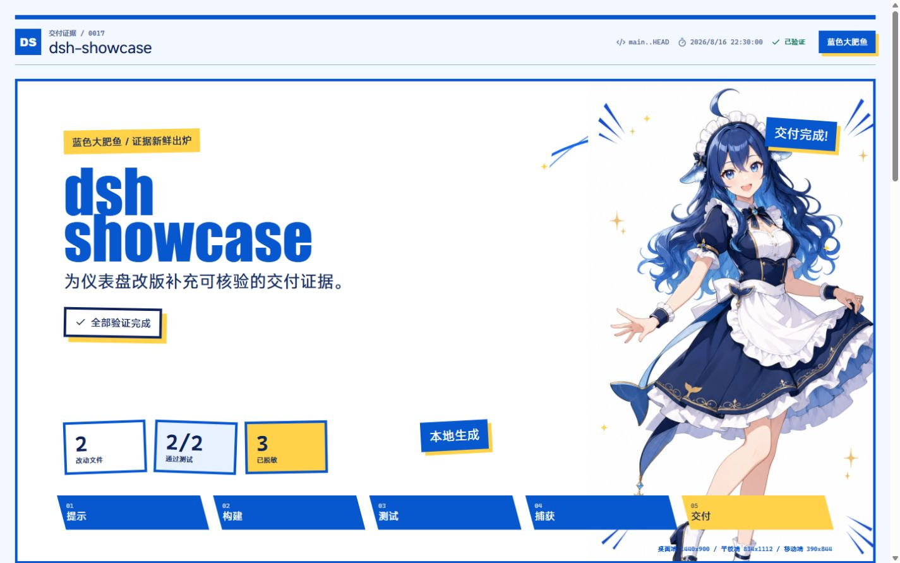
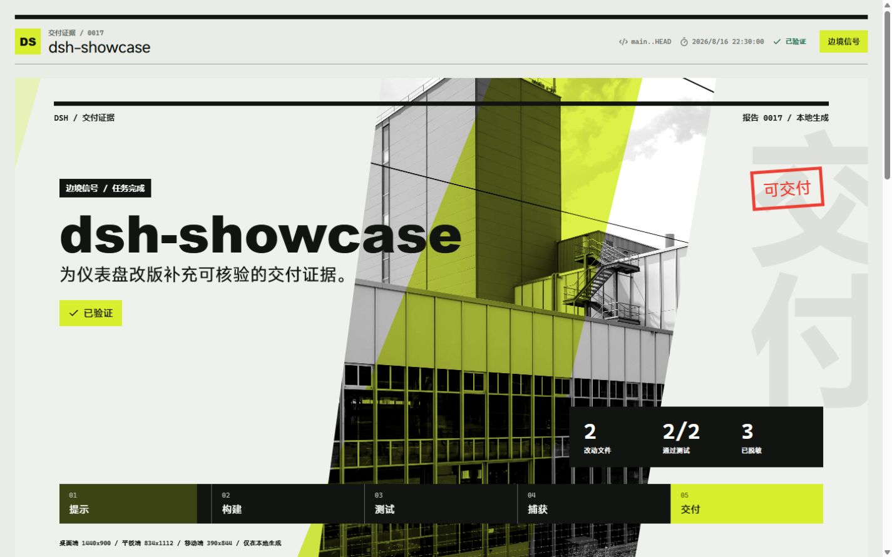
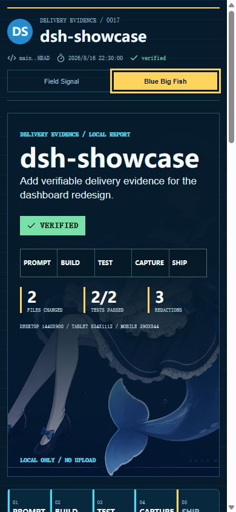

# dsh-showcase

[English README](README.md)

面向编程 Agent 工作的本地、可核验交付证据报告工具。



`dsh-showcase` 将本地项目证据整理为便于审查的产物：Git 改动、测试回执、脱敏结果、布局证据和可视化报告。它不要求账号，也不要求上传内容。

## 已实现能力

- 证据报告：收集任务元数据、Git 改动、测试回执和脱敏汇总。
- Git 证据：支持当前工作区改动或配置的基准引用。
- 测试回执：记录命令、耗时、退出码、状态和已脱敏输出。
- 脱敏：对常见 Token、Authorization 值、GitHub Token 格式和本机绝对路径进行处理。
- 双主题报告界面：**边境信号** 与 **蓝色大肥鱼**。
- 克制的常驻氛围动效：边境信号包含扫描与刻度运动；蓝色大肥鱼包含角色漂浮、水面光纹、气泡和声呐环，并支持 `prefers-reduced-motion`。
- CLI：初始化本地配置并采集报告。
- DSH 插件工具 `showcase_layout_summary`：生成本地 Markdown 布局摘要和自包含证据海报。
- 本地 Markdown 产物和自包含 HTML 海报。插件只读取项目文件、只在项目内写入，不上传内容。





## 快速开始

安装依赖后，在需要生成证据的项目中初始化并采集：

```bash
npm ci
npm run init
npm run capture
```

`npm run init` 会创建 `.showcase/config.json`。可在其中设置任务说明、可选 Git 基准引用、测试命令与超时时间。`npm run capture` 会写入 `.showcase/report.json`。

配置示例：

```json
{
  "task": "Capture verifiable delivery evidence.",
  "baseRef": "main",
  "tests": [
    "npm test -- --run",
    { "command": "npm run typecheck", "timeoutMs": 120000 }
  ],
  "timeoutMs": 120000
}
```

## DSH 插件

在本仓库目录中，为 web profile 添加插件：

```bash
dsh plugin --profile web add .
```

重启 DSH 后，必须新建一个会话，工具才会出现；已有会话不会加载新加入的插件工具。

在 **设置 → 插件 → 插件配置 → 布局证据海报** 中选择唯一的 **海报风格**：`边境信号` 或 `蓝色大肥鱼`。选项保存在 DSH 的用户设置中，每次调用只生成当前选中的风格，不会同时输出两套海报。

`showcase_layout_summary` 的参数示例：

```json
{
  "projectPath": ".",
  "reportPath": ".showcase/report.json",
  "outputPath": ".showcase/layout-summary.md",
  "posterPath": ".showcase/layout-poster.html",
  "locale": "zh-CN"
}
```

只有 `projectPath` 必填。`locale` 可选，默认值为 `zh-CN`；传入 `en` 可生成英文输出。其余路径均为可选的项目相对路径。生成的 Markdown 摘要与 HTML 海报保留在本地项目中。

## 开发命令

```bash
npm ci
npm run dev
npm run typecheck
npm test
npm run build
npm run cli -- init
npm run cli -- capture
```

## 项目结构

```text
src/
  cli/          本地 init 与 capture 命令
  core/         报告 schema、Git 采集、命令回执、脱敏
  App.tsx       报告界面和主题支持
plugin/
  index.js      DSH 插件注册
  layout-summary.js
                本地布局摘要和自包含海报生成器
  assets/       插件海报素材
docs/assets/    README 报告截图
```

## 路线图

- 为 capture 扩展响应式截图采集。
- 从 CLI 导出更多静态报告产物。
- 在保持本地优先报告格式的前提下，增加更多编程 Agent 适配器。

## 隐私

报告在本地生成。写入报告前，采集到的测试输出会经过常见凭据和本机绝对路径的脱敏规则。分享前仍应审查生成产物：脱敏规则可降低意外泄露风险，但无法保证识别所有敏感信息。

仓库许可证范围和演示角色素材的单独声明见 [CHARACTER_ASSET_NOTICE.md](CHARACTER_ASSET_NOTICE.md)。

## 许可证

MIT，详见 [LICENSE](LICENSE)。
